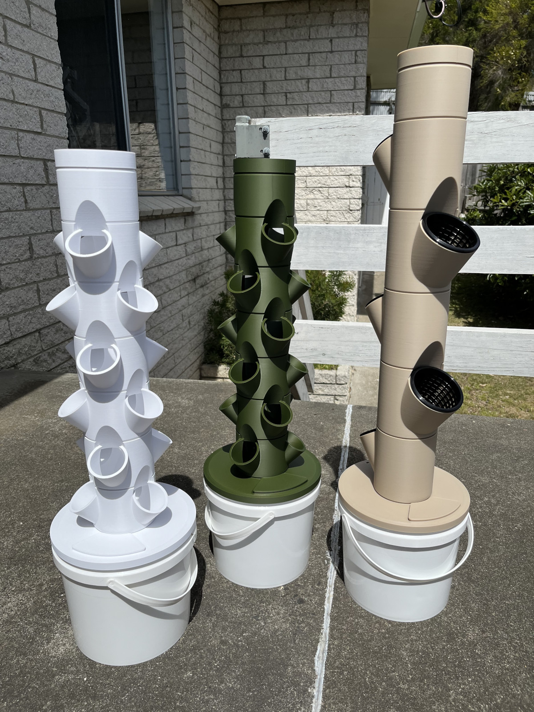

# Miniature, Modular, Indoor Grow Towers

## What is this?

These are hydroponic[^1] grow towers! The concept isn't new, and it's pretty straightforward: Instead of planting in soil, you plant in a loose medium like perlite or coco peat. Rather than the plants deriving nutrients from the growing medium, nutrients are dissolved in water, and that water is circulated through the system to deliver moisture and nutrients to the plants' roots. Because the water is recirculated and delivered directly to plants' roots, grow towers can be extremely water-efficient! Because nutrients are dissolved in the water itself, it's easy to control exactly what you put into the system, which means you can tailor it to the needs of whatever you've planted.

That said, I'm only a novice gardener, so I take a more simple approach: I use a general-purpose nutrient solution for all of my grows, and it seems to work out great for things like herbs and tomatoes! Hydroponic gardening can be as in-depth or as straightforward as you want it to be; it can be easy to start, and the complexity of the hobby can grow alongside your level of experience. :)

All of the parts in this project are designed to be 3D-printable without supports, and they're modular, meaning you can choose how many "planter" modules to put together to build your tower.

The planter modules come in two varieties: modules which fit a single 80mm net-pot per module; and modules which fit three 50mm net-pots per module. These net pots are easy to find at your local hydroponics shop or online if you don't have a shop nearby. For most herbs, lettuces, and even fruiting vegetables like tomatoes and peas, I recommend starting with the 50mm modules. Whereas you would normally need to use pots large enough to contain a plant's entire root system, net pots are designed to allow the root system to grow beyond the pot and down into the tower itself, so as long as a plant's base can fit in the diameter of the pot, you're golden!

[^1]: Well, technically, they could be called *aeroponic* grow towers. The best distinction I've heard between hydroponics and aeroponics is that if the roots are exposed to air, it's an aeroponic system. In theory, you could rig up one of these towers with some 4mm micro sprays or the like instead of the provided showerhead -- or you could even forego using a pump entirely and instead place a fog generator in the reservoir to experiment with fogponics! -- but I haven't tried it myself.

## What can I grow in these?

Pretty much anything except root vegetables! Lettuces, herbs, and peas are an easy place to start. Tomatoes are pretty easy too! It could even be fun to grow ornamentals in the towers, but my primary goal is to get people growing their own food.

## How do I get started? What do I need?

First things first: **Talk to the folks at your local hydroponics shop.** They're going to know way, *way* more than me about hydroponics and about growing plants in general. They'll be able to recommend nutrient solutions, pH buffers, and tools. **More importantly, they'll likely be able to advise you about hydroponics safety.** Not only does hydroponics involve the use of some simple chemicals like acidic and alkaline solutions for balancing pH, but a hydroponics system improperly tended to can become host to unwanted pathogens. The following advice is **general** in nature.

### To get started, you'll need a few items outside of the tower itself:
#### Non-printable components:
* A submersible pump to sit in the tower reservoir.[^2] I use [Aqua One Maxi 103](https://aquaone.com.au/2015-04-16-04-47-04/filtration/pumps-2/item/2702-11321-11322-11323-11324-11325-11326) pumps in my towers, but your hydroponics shop can advise you. You'll need to compare the height of your tower to the pump's **maximum head height.** If your tower is taller than that head height, your pump will struggle to push water to the top! If the maximum head height is significantly *higher* than the height of your tower, you may end up with too much water pressure for the system to handle.
* An outlet timer to switch your pump on and off automatically.[^2] I recommend a cycle of 15 minutes on, then one hour off.
* A way to adapt your pump's outlet to 13mm tubing.
* A length of 13mm tubing equal to the distance from your pump's outlet to shower head inlet about halfway up the "chimney module" -- that's the module at the top into which the shower head is inserted.
* A bucket to serve as your system's reservoir. At the moment, the design suits only Ayva brand 5L buckets. These are an Australian make of bucket commonly available individually at Bunnings Warehouse under the brand name [Handy Pail](https://www.bunnings.com.au/handy-pail-5l-plastic-pail-with-lid_p4475883). My hope is that as people take notice of the project, folks will contribute revised bucket lid designs suitable for buckets available in countries other than Australia.
* Either 50mm or 80mm net pots (external diameter). While I haven't included a design for those in this project, there are actually a [ton of available printable versions](https://thangs.com/search/net%20pot?scope=all)!

#### Tools:
* A pH meter is really important to make sure your nutrient solution is in the right pH range for your plants.
* Eyedroppers are a great way to dispense the small amounts of buffer needed to balance your nutrient solution's pH.
* A small graduated cylinder or conical medicine measure -- that's what I use -- is perfect for measuring out concentrated nutrient solution for mixing. Conical medicine measures can be found at chemists (pharmacies), and they're very inexpensive.

#### Consumables:
* Concentrated nutrient solution
* Hydroponics acid, often called "pH down"[^3]
* Hydroponics base, often called "pH up"[^3]
* It's best practice -- many would say a must -- to use a cleaning agent to sterilize your tower as much as possible before planting and filling with nutrient solution. The folks at your local hydroponics shop can advise you.
* A planting medium. I prefer perlite for its excellent drainage, but coco peat is a perfectly valid option too. Your local hydroponics shop can advise you.
* Water of course!
* Your local hydroponics shop can advise you about other additives to help keep your system healthy.

#### Optional stuff if you wanna go wild:
* A grow lamp
* A grow tent
* A little fan to help air circulate through your plants
* A trellis or trainer and twine is quite helpful for plants like peas and tomatoes.

[^2]: These towers **can** leak. Be sure to place them such that any leaks wouldn't reach electrical outlets or electrical devices.
[^3]: Remember, it's of paramount importance to exercise caution and wear appropriate personal protective equipment when handling harsh chemicals such as (but not limited to) acids, bases, and oxidizing agents.

### How many modules should I use?
I recommend starting with just one or two of the 50mm planter modules. Each 50mm module will give you three net-pot receptacles, and you may be surprised by how much water your chosen plants will consume once they reach a decent size. One of the limitations of these towers as they are is the reservoir size. At 5L, the reservoir can be drained pretty quickly by a fully populated, reasonably tall tower! However, I've also provided what I'm calling a ["bulkhead fitting"](https://github.com/danielle-sopalski/towers/blob/main/bucket%20lid/Bulkhead%20for%20Larger%20Systems.step), which can be fastened with screws to larger reservoir lids as an alternative to the printable bucket lid for those who want to try building larger systems (or even systems with multiple towers attached to the same large reservoir).

### Once you have everything you need, be sure to check out the [assembly manual](https://github.com/danielle-sopalski/towers/blob/main/manual/main.pdf). It's not yet complete -- a couple of sections are filled with *Lorem ipsum* -- but it contains complete assembly instructions, and I've put a lot of effort into making wireframe diagrams that I hope will help!

## Printing Recommendations

The towers were designed to be printed by my Bambu Lab P1S printer, but they should be printable on any decent FDM printer, maybe with some tweaking of clearances.

**All parts are designed to be printed without supports.** Examples of recommended print orientation can be found in the example 3MF files. When printed with the recommended orientation and on a print surface such as textured PEI, the result should be a nice, textured finish on all upward-facing surfaces of the assembled tower. :)

For parts with little surface area contacting the print bed, eg planter modules, an inner brim can be used to promote bed adhesion.

I recommend using PLA+ and **strongly** recommend you find **food-grade** filament to print with.[^4]

Generally, I've been printing with:
* 0.28mm layer height
* 0.4mm nozzle, though 0.6mm or larger certainly isn't out of the question!
* 3 wall loops for planter modules; 6 wall loops for the bucket lid
* 3 top and bottom shell layers
* Rectilinear top and bottom surface pattern for the bucket lid; concentric top and rectilinear bottom surface pattern for the planter modules, bucket lid cap, bucket lid lock-ring, bucket lid cable glands, tower chimney, chimney lid
* **No supports**
* Gyroid infill, 15%

[^4]: Remember: Just because your filament is food-grade doesn't mean your printer or finished prints are!

## Intention

This is a project I've been working on for a little while with the intention, up until now, of starting a small business centered around hyper-local manufacturing of goods. The hope was to promote the idea of "garage factories," tiny print farms in people's spare space serving local communities with goods that would otherwise need to be sourced from large factories far away. Truth be told, though, I'm not a business person, and I don't think I want to move forward with it myself -- or at least not alone -- so I'm opening the project in the hope that others will see value in it and contribute their time and abilities to making it better than I ever could by myself.

My hope now is that folks will go about producing these grow towers for their own local communities, promoting both hyper-local manufacturing and home-grown produce.

## What's Here

These are small, modular, indoor, hydroponic grow towers made to sit in a living room or by a window. Included in the repo are:
* A variant with one 80mm net-pot receptacle per module: Fusion 360, STEP
* A variant with three 50mm net-pot receptacles per module: Fusion 360, STEP
* A mostly-complete (though certainly not perfectly written) user manual: PDF, (badly written) LaTeX; A4 format as well as A5 booklet format
* Wireframe diagrams of all parts and assembly steps: SVG
* 3MF files of all parts offering example printing parameters.

## What Needs to Be Done

A number of things need improvement:
* The manual needs an introduction, a sensible list of precautions, cleaning and maintenance recommendations, and general proofreading and refinement.
* The Fusion 360 files need to be cleaned up. I'm bad at keeping things organized while I work.
* **The current design only suits a common Australian brand of 5L bucket.** I'd love it if folks could contribute revised versions that suit buckets available in other parts of the world.
* We need a good open-source license that allows individuals to freely produce and sell these towers while excluding large manufacturers, corporations, and the wealthy. For now, I'm opting for the [Creative Commons Attribution-NonCommercial-ShareAlike 4.0 International license](https://creativecommons.org/licenses/by-nc-sa/4.0/).

### Models from this project are also published to [Thangs](https://thangs.com/designer/danielle.sopalski/3d-model/Dani%27s%20Miniature%20Grow%20Towers-995522?manualModelView=true&source=All+Files) and [Thingiverse](https://www.thingiverse.com/thing:6444781).
